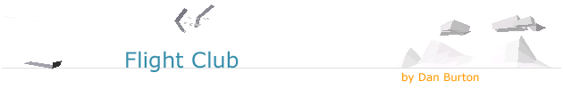
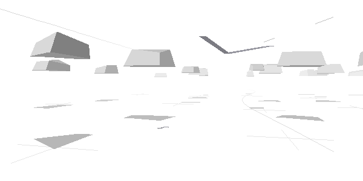
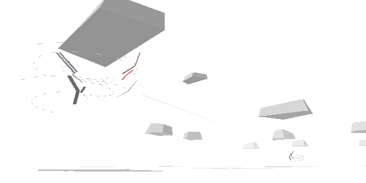
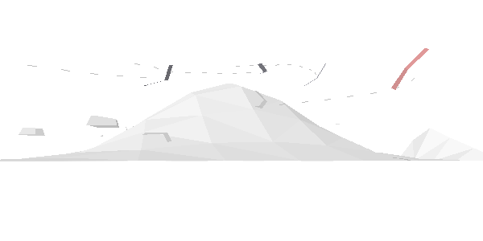
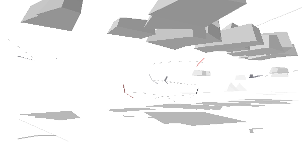
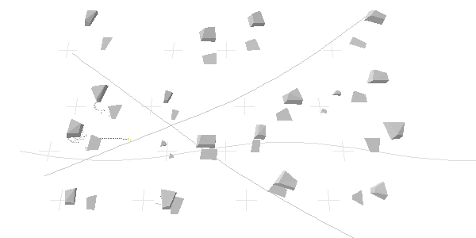

# 

## Introduction

Welcome to Flight Club, an online gliding simulator. The gliders look a bit like hang gliders. However, imagine them to be paragliders or sailplanes if you prefer; the same rules apply.

### Thermals

Cumulus clouds are fed by bubbles of warm rising air, called thermals. By using thermals, glider pilots are able to fly long distances. When you fly into a thermal you should circle to stay in the lift and climb upto cloud base.

Your vario will start beeping when you are in a thermal.

### Ridge Lift

Hills produce lift as the wind flows over them. A glider may ridge soar by flying back and forth in the rising air in front of the hill.

Glider pilots also like hills because they function as reliable thermal triggers.

### Your mission

Race against the other gliders; the finish line is 100km away to the north.

A note on navigation: To find the finish line, simply follow the road that runs north. You have a compass at the bottom right of the applet.

### Points of View

Drag the mouse to rotate the camera position. You may switch between points of view using the number keys...

    <1> focus on your glider
    <2> watch the gaggle
    <3> the view from 5,000 meters above
    <4> the view from 8km away to the south east

Try pressing `
` to pause the action and then switch between the different points of view.

Dragging the mouse whilst the action is paused gives a cool 'bullet time' effect.

## Build Instructions

This project is now using the [gradle](http://www.gradle.org/) build system. To build the project run the following command from the command line:

    $ ./gradlew build

Use `./gradlew run` to run the game afterwards.

## Coding Style

For a general coding style guide, where better to look than the horses
mouth ? Look for some classes that interest you and study them
carefully. The author of this document finds Date.java, written by
James Gosling, a good read.

Code that is not well commented is probably not well thought out.

Here are some conventions used in Flight Club:

    float[] p; // a point whose x, y and z co-ords are (p[0], p[1], p[2])
    float[] _p; // the previous value of p
    float[] p_; // the co-ords of p after applying a transformation, T
    float[] dp; // a small change in p, say p(tN) - p(tN-1) where tN is
    the time of the Nth frame and p(t) is the path of a particle
    float[][] ps; // a list of points {{x0, y0, z0}, {x1, y1, z1}, ...}
    float[] ps; // a flattened list of points {x0, y0, z0, x1, y1, z1, ...}

## Author

Created by Dan Burton <danb@dircon.co.uk>, 22 Aug 2002
